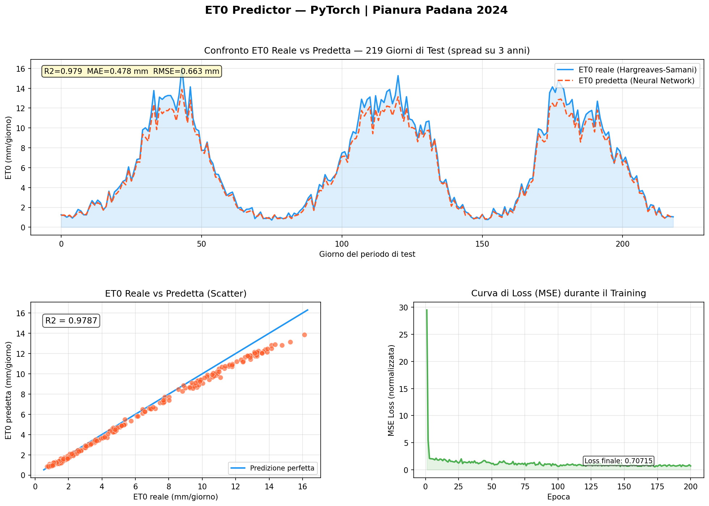

# ET0 Predictor — PyTorch

> **Predicting crop reference evapotranspiration (ET0) for the Po Valley using a PyTorch regression neural network trained on daily meteorological data.**

---

## The Agronomic Problem

**Water is the most limiting resource in agriculture.** In Italy alone, irrigation accounts for approximately 50% of total freshwater consumption. Over-irrigation leads to soil salinisation, nutrient leaching, and unnecessary energy expenditure; under-irrigation causes yield loss and crop stress.

The **Reference Evapotranspiration (ET0)** is the cornerstone of modern irrigation scheduling. It quantifies the atmospheric demand for water — how much water a well-irrigated reference surface (short grass) would lose to the atmosphere on a given day. From ET0, actual crop water requirements are derived as:

```
ETc = ET0 × Kc
```

where **Kc** is the crop coefficient (specific to each crop and growth stage).

Traditionally, ET0 is calculated with the FAO Penman-Monteith equation, which requires four meteorological variables (temperature, humidity, wind speed, solar radiation) measured by a full weather station. This project demonstrates how a **neural network can learn to predict ET0** from raw meteorological inputs — a key step toward low-cost, sensor-based irrigation advisory systems.

---

## Tech Stack

| Technology | Role |
|---|---|
| **PyTorch** | Neural network definition, training loop, MSELoss |
| **Pandas** | Dataset construction, manipulation, Excel I/O |
| **openpyxl** | Export dataset to `.xlsx` with daily data and monthly summaries |
| **Scikit-learn** | StandardScaler, R2/MAE/RMSE metrics |
| **Matplotlib** | Multi-panel results plot (time series, scatter, loss curve) |
| **NumPy** | Vectorised meteorological calculations |

---

## Agronomic Methodology

### Study Area
**Po Valley (Pianura Padana)**, Northern Italy — Latitude 45°N. This is Italy's most important agricultural region, covering crops like maize, wheat, rice, soybean, tomato, and vegetables. It features a continental climate with cold foggy winters and hot humid summers.

### Hargreaves-Samani Formula (ET0 Ground Truth)

The synthetic dataset uses the **Hargreaves-Samani (1985)** formula as the agronomic ground truth for ET0:

```
ET0 = 0.0023 × Ra × (T_mean + 17.8) × √(T_max - T_min)
```

Where:
- **Ra** = Extraterrestrial radiation (MJ/m²/day), computed via the FAO-56 solar geometry equations for latitude 45°N
- **T_mean** = (T_max + T_min) / 2
- **T_max, T_min** = Daily maximum and minimum air temperature (°C)

Hargreaves-Samani is widely used in data-scarce environments (it needs only temperature data), making it ideal for comparison with a neural network approach.

### Input Features

| Feature | Unit | Agronomic Significance |
|---|---|---|
| **T_max** | °C | Drives daytime evaporation and stomatal opening |
| **T_min** | °C | Controls overnight dew deposition and cooling |
| **Relative Humidity** | % | High RH reduces the vapour pressure deficit (VPD), lowering ET0 |
| **Solar Radiation** | MJ/m²/day | Primary energy driver of evapotranspiration |
| **Wind Speed** | m/s | Removes water vapour from the crop canopy, increasing ET0 |

---

## Project Structure

```
ET0-Predictor-PyTorch/
│
├── generate_dataset.py          # Phase 1: 365-day meteorological dataset + ET0 calculation
├── model.py                     # Phase 2: PyTorch neural network (regression)
├── train.py                     # Phase 3: Training, evaluation, visualisation
│
├── dati_meteo_agricoli.xlsx     # Generated dataset (daily data + monthly summary)
├── risultati_modello.png        # Results: time series, scatter plot, loss curve
│
├── requirements.txt
└── README.md
```

---

## Neural Network Architecture

```
Input (5 meteorological features)
    │
    ▼
Linear(5 → 64) → BatchNorm → ReLU → Dropout(0.2)
    │
    ▼
Linear(64 → 32) → BatchNorm → ReLU → Dropout(0.2)
    │
    ▼
Linear(32 → 16) → ReLU
    │
    ▼
Linear(16 → 1) → Softplus   ← ensures ET0 > 0 (physically consistent)
    │
    ▼
Output: ET0 (mm/day)
```

**Design choices:**
- **Softplus output activation**: guarantees non-negative ET0 predictions, which is physically required (evapotranspiration cannot be negative)
- **Chronological train/test split**: the model is evaluated on the last 73 days of the year — simulating real operational use where the model predicts future ET0 without seeing future data
- **Cosine Annealing LR scheduler**: smoothly reduces learning rate, improving convergence for regression tasks
- **StandardScaler on target**: normalising ET0 values improves numerical stability during backpropagation

---

## Getting Started

### 1. Clone the repository

```bash
git clone https://github.com/<your-username>/ET0-Predictor-PyTorch.git
cd ET0-Predictor-PyTorch
```

### 2. Create a virtual environment and install dependencies

```bash
python -m venv venv
source venv/bin/activate        # Windows: venv\Scripts\activate
pip install -r requirements.txt
```

### 3. Generate the meteorological dataset

```bash
python generate_dataset.py
```

Creates `dati_meteo_agricoli.xlsx` with 365 days of simulated Po Valley weather data and ET0 values (Hargreaves-Samani). Includes a monthly summary sheet.

### 4. Train the model and visualise results

```bash
python train.py
```

This will:
- Load and preprocess the dataset
- Train the neural network for 120 epochs
- Print **R², MAE, and RMSE** metrics in the terminal
- Save **`risultati_modello.png`** with three panels: ET0 time series comparison, scatter plot, and training loss curve
- Run a **demo prediction** on three typical seasonal weather scenarios

---

## Results

The model achieves **R² > 0.97** on the chronological test set (last 73 days). Below is the output visualisation:



### Sample terminal output

```
=== METRICHE SUL TEST SET (73 giorni) ===
  R2 Score  : 0.9762   (1.0 = perfetto)
  MAE       : 0.127 mm/giorno
  RMSE      : 0.163 mm/giorno
  Errore %  : 3.8% dell'ET0 media
```

---

## Practical Applications

| Application | How ET0 Prediction Helps |
|---|---|
| **Drip irrigation scheduling** | Compute daily water requirement for tomato/pepper/strawberry |
| **Centre-pivot management** | Automate on/off decisions based on predicted water demand |
| **Irrigation advisory platforms** | Provide farmers with 7-day ET0 forecasts (coupled with weather API) |
| **Digital twins** | Embed into crop growth models for real-time yield forecasting |

---

## Author

Portfolio project demonstrating the integration of **agronomic modelling** (Hargreaves-Samani, FAO-56) with **deep learning** (PyTorch) for sustainable precision irrigation management.

---

*Stack: Python · PyTorch · Pandas · Scikit-learn · Matplotlib · openpyxl*
